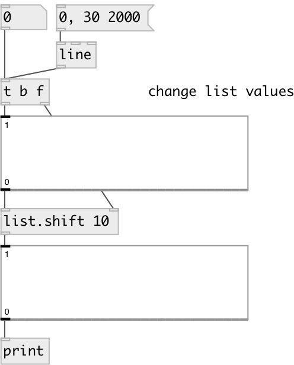

[index](index.html) :: [list](category_list.html)
---

# list.shift

###### shifts the contents of the list with linear interpolation

*доступно с версии:* 0.1

---

## аргументы:

* **SHIFT**
shift amount. Float values cause linear interpolation. Can be negative. 
_тип:_ float 

## свойства:

* **@shift** 
Запросить/установить shift amount 
_тип:_ float 
_по умолчанию:_ 0 

## входы:

* input list 
_тип:_ control
* shift value 
_тип:_ control

## выходы:

* new modified list 
_тип:_ control

## ключевые слова:

[list](keywords/list.html)

**Смотрите также:**
[\[list.rotate\]](list.rotate.html)

**Авторы:** Alex Nadzharov, Serge Poltavsky

**Лицензия:** GPL3 or later

