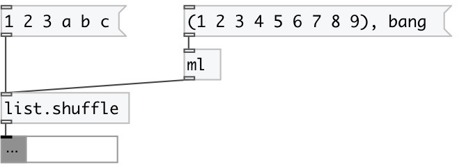

[index](index.html) :: [list](category_list.html)
---

# list.shuffle

###### randomly rearranges elements in list

*доступно с версии:* 0.1

---

## входы:

* input list 
_тип:_ control

## выходы:

* new shuffled list 
_тип:_ control

## ключевые слова:

[list](keywords/list.html)
[shuffle](keywords/shuffle.html)
[random](keywords/random.html)

**Смотрите также:**
[\[list.sort\]](list.sort.html)
[\[list.reverse\]](list.reverse.html)

**Авторы:** Serge Poltavsky

**Лицензия:** GPL3 or later

