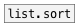

[< справка — содержание](index.html)
---

# list.shuffle


Переставляет элементы списка в случайном порядке

---

<br>


---


```


[1 2 3 a b c( [\(1 2 3 4 5 6 7 8 9\), bang(
|             |
|             [ml]
|             |
[list.shuffle ]
|
[ui.display @display_type=1]

            
```

---
аргументы:


---
свойства:


---
смотрите также:<br>
[](list.sort.html)
[](list.reverse.html)
