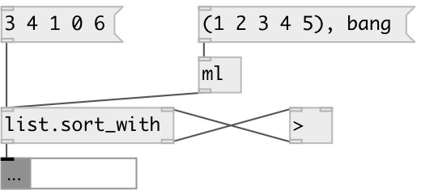

[index](index.html) :: [list](category_list.html)
---

# list.sort_with

###### sort list with user defined side-chain

*доступно с версии:* 0.2

---

## входы:

* input list 
_тип:_ control
* output from compare object (1 or 0) 
_тип:_ control

## выходы:

* sorted list (or mlist) 
_тип:_ control
* output list with two element to compare side-chain 
_тип:_ control

## ключевые слова:

[list](keywords/list.html)
[sort_with](keywords/sort_with.html)

**Смотрите также:**
[\[list.sort\]](list.sort.html)

**Авторы:** Serge Poltavsky

**Лицензия:** GPL3 or later

