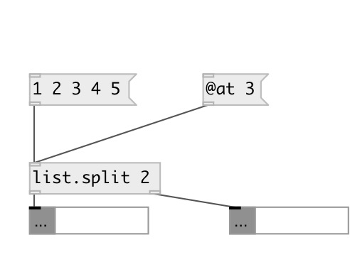

[index](index.html) :: [list](category_list.html)
---

# list.split

###### splits list into two parts, the length of first list is specified by the argument

*доступно с версии:* 0.1

---

## аргументы:

* **AT**
size of first list. The size of the list on the second output is the size of
input list - this value 
_тип:_ int 

## свойства:

* **@at** 
Запросить/установить split point 
_тип:_ int 
_минимальное значение:_ 0 
_по умолчанию:_ 0 

## входы:

* input list 
_тип:_ control

## выходы:

* first sub-list of given size 
_тип:_ control
* second sub-list 
_тип:_ control

## ключевые слова:

[list](keywords/list.html)
[split](keywords/split.html)
[moses](keywords/moses.html)

**Смотрите также:**
[\[list.at\]](list.at.html)

**Авторы:** Alex Nadzharov, Serge Poltavsky

**Лицензия:** GPL3 or later

