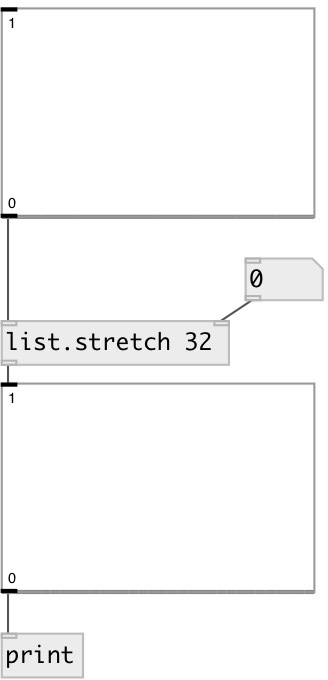

[index](index.html) :: [list](category_list.html)
---

# list.stretch

###### stretches list - changes its size with linear interpolation

*доступно с версии:* 0.1

---

## аргументы:

* **SIZE**
New size of output list. Input list will be stretched to the new size with
linear interpolation 
_тип:_ int 

## свойства:

* **@size** 
Запросить/установить new size 
_тип:_ int 
_минимальное значение:_ 0 
_по умолчанию:_ 1 

## входы:

* input list. 
_тип:_ control
* new length of output list 
_тип:_ control

## выходы:

* new modified list 
_тип:_ control

## ключевые слова:

[list](keywords/list.html)

**Смотрите также:**
[\[list.shift\]](list.shift.html)

**Авторы:** Alex Nadzharov, Serge Poltavsky

**Лицензия:** GPL3 or later

