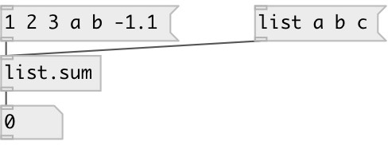

[index](index.html) :: [list](category_list.html)
---

# list.sum

###### calculates sum of floats in list

*доступно с версии:* 0.1

---

## входы:

* input list. Non float values are ignored 
_тип:_ control

## выходы:

* float list sum 
_тип:_ control

## ключевые слова:

[list](keywords/list.html)
[sum](keywords/sum.html)

**Смотрите также:**
[\[list.product\]](list.product.html)
[\[list.reduce\]](list.reduce.html)

**Авторы:** Serge Poltavsky

**Лицензия:** GPL3 or later

