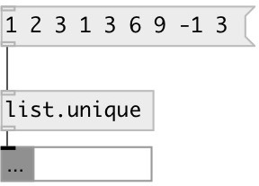

[index](index.html) :: [list](category_list.html)
---

# list.unique

###### removes duplicates from input list

*доступно с версии:* 0.1

---

## свойства:

* **@stable** 
Запросить/установить if true - preserves element appearing order 
_тип:_ bool 
_по умолчанию:_ 1 

## входы:

* input list 
_тип:_ control

## выходы:

* output list 
_тип:_ control

## ключевые слова:

[list](keywords/list.html)
[unique](keywords/unique.html)
[sort](keywords/sort.html)

**Смотрите также:**
[\[list.sort\]](list.sort.html)

**Авторы:** Serge Poltavsky

**Лицензия:** GPL3 or later

