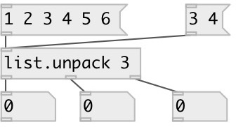

[index](index.html) :: [list](category_list.html)
---

# list.unpack

###### unpack list elements to separate outlets

*доступно с версии:* 0.3

---

## аргументы:

* **N**
number of outlets 
_тип:_ int 

## входы:

* input list 
_тип:_ control

## выходы:

* outlet for first atom in list 
_тип:_ control
* None 
_тип:_ control
* outlet for Nth atom in list 
_тип:_ control

## ключевые слова:

[list](keywords/list.html)
[unpack](keywords/unpack.html)

**Смотрите также:**
[\[list.repack\]](list.repack.html)
[\[list.separate\]](list.separate.html)

**Авторы:** Serge Poltavsky

**Лицензия:** GPL3 or later

