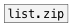

[< справка — содержание](index.html)
---

# list.unzip


Разделяет список на N списков и отправляет их на отдельные выходы

---

Для N = 2 и списка [1 2 3 4] мы получаем [1 3] на выходе 1 и [2 4] на выходе
            2.
Если в этом случае входящее значение [1 2 3 4 5], то результат зависит от установленного способа разделения.
Если установлен метод @min, на выходах будет [1 3 5] и [2 4]. Если установлен метод @pad со значением
            X, выходу будут [1 3 5] и [2 4 X]
<br>


---


```


[1 2 3 4( [1 2 3 4 5(
|         |
|         |
|  [dump( |     [@min( [@pad X(
|  |      |     |      |
|  |      |     |      |
|  |      |     |      |
[list.unzip           2]
|              ^|
[msg set]      [msg set]
|               |
[ (             [ (

            
```

---
аргументы:

N: количество выходов<br>

---
свойства:

@method: метод разделения для случая, если длина входящего списка не кратна количеству выходов<br>
@min: сокращение для @method min. Используется минимальный размер списка.<br>
@pad:  значение для заполнения. Выходной список дополняется в конце указанными значениями в случае если длина входного списка не кратна количеству выходов<br>

---
смотрите также:<br>
[](list.zip.html)
