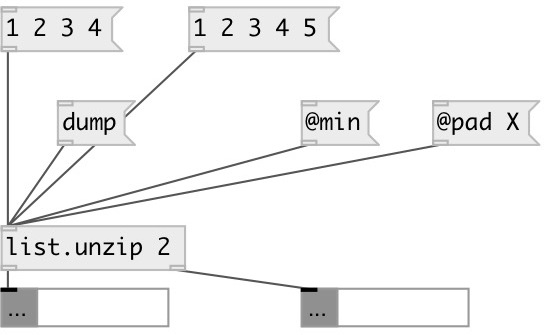

[index](index.html) :: [list](category_list.html)
---

# list.unzip

###### splits list to N lists, each to separate output

*доступно с версии:* 0.1

---

## информация
For N = 2 and list elements [1 2 3 4] we get [1 3] on output 1 and [2 4] on output 2. If input value is [1 2 3 4 5] the output depends on split method. If @min method used, output is [1 3 5] and [2 4]. If @pad method used with value X, output if [1 3 5] and [2 4 X]

## аргументы:

* **N**
number of output outlets 
_тип:_ int 

## свойства:

* **@method** 
Запросить/установить split method if number element in the input list is not multiple of number of
outputs 
_тип:_ symbol 
_варианты:_ min, pad 
_по умолчанию:_ min 

* **@min** 
Запросить/установить alias to @method min. No padding used 
_тип:_ alias 

* **@pad** 
Запросить/установить padding value. Pads result lists with specified value, if number of elements in
the input list is not multiple of number of outputs 
_тип:_ atom 
_по умолчанию:_ 0 

## входы:

* input list 
_тип:_ control

## выходы:

* unzipped list 
_тип:_ control

## ключевые слова:

[list](keywords/list.html)

**Смотрите также:**
[\[list.zip\]](list.zip.html)

**Авторы:** Alex Nadzharov, Serge Poltavsky

**Лицензия:** GPL3 or later

