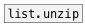

[< справка — содержание](ceammc_lib.html)
---

# list.zip


принимает n списков из n входов (указанных в аргументе) и отправляет их значения последовательно (list1-1 list2-1 list1-2 list2-2 итд.).

---

<br>


---


```


[10 20 30(  [list a b( [1 2 3 4 5(
|           |          |
|  [@pad(   |  [@clip( |    [@wrap( [@fold(
|  |        |  |       |    |       |
|  |        |. |       |..  |       |
[list.zip                     3 @min]
|
[msg set]
|
[ (

            
```

---
аргументы:

N: количество входов<br>

---
свойства:

@method: 
            поведение объекта в случае если у списков разные размеры<br>
@min: сокращение для свойства &#34;@oversize min&#34;. Сокращает список до минимальной длины<br>
@clip: сокращение для свойства &#34;@oversize clip&#34;. Дополняет самый короткий список последним элементом из этого списка до количества элементов самого длинного списка<br>
@wrap: сокращение для свойства &#34;@oversize wrap&#34;. Дополняет самый короткий список его значениями с начала.<br>
@fold: сокращение для свойства &#34;@oversize fold&#34; property. Дополняет самый короткий список его значениями с конца до начала, затем обратно до конца итд.<br>
@pad: значение для заполнения если указан метод изменения размера списка, который его использует<br>
@l0: первый список<br>
@l1: второй список, итд.<br>

---
смотрите также:<br>
[](list.unzip.html)
