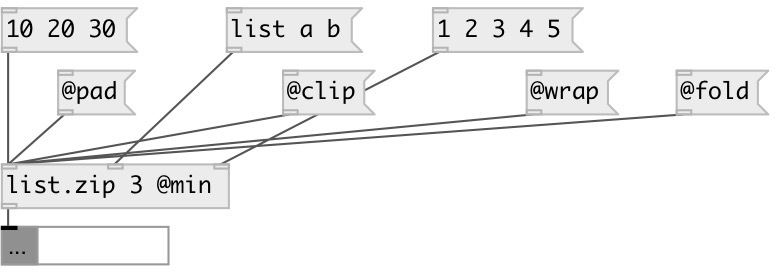

[index](index.html) :: [list](category_list.html)
---

# list.zip

###### takes n lists from n inlets (specified by argument) and output their elements sequentially (list1-1 list2-1 list1-2 list2-2 etc.).

*доступно с версии:* 0.1

---

## аргументы:

* **N**
number of inputs 
_тип:_ int 

## свойства:

* **@method** 
Запросить/установить behavior, if list have different sizes 
_тип:_ symbol 
_варианты:_ min, pad, clip, wrap, fold 
_по умолчанию:_ min 

* **@min** 
Запросить/установить alias for &#34;@oversize min&#34; property. Truncates lists to minimal common size 
_тип:_ alias 

* **@clip** 
Запросить/установить alias for &#34;@oversize clip&#34; property. Pad shortest list with last element to
conform longest list 
_тип:_ alias 

* **@wrap** 
Запросить/установить alias for &#34;@oversize wrap&#34; property. Pad shortest list with repeated values
from the beginning. 
_тип:_ alias 

* **@fold** 
Запросить/установить alias for &#34;@oversize fold&#34; property. Pad shortest list with repeated values
from the end to the beginning, then back and so on. 
_тип:_ alias 

* **@pad** 
Запросить/установить pad value for pad method of resizing 
_тип:_ atom 
_по умолчанию:_ 0 

* **@n** (initonly)
Запросить/установить number of inputs 
_тип:_ int 
_диапазон:_ 2..20 
_по умолчанию:_ 2 

* **@lists** (readonly)
Запросить input data list: list of data:mlist 
_тип:_ list 

## входы:

* input list 
_тип:_ control

## выходы:

* interleaved list 
_тип:_ control

## ключевые слова:

[list](keywords/list.html)
[functional](keywords/functional.html)

**Смотрите также:**
[\[list.unzip\]](list.unzip.html)

**Авторы:** Alex Nadzharov, Serge Poltavsky

**Лицензия:** GPL3 or later

