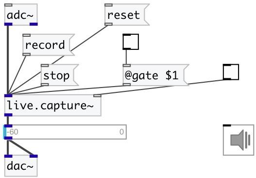

[index](index.html) :: [live](category_live.html)
---

# live.capture~

###### record up to 32s of sound and playback the recorded sound in loop

*доступно с версии:* 0.1

---

## методы:

* **record**
start record 

* **reset**
reset recorded data 

* **stop**
stop record 

* **div**
set rec division 
  __параметры:__
  - **[N]** value 
    тип: int  

## свойства:

* **@gate** 
Запросить/установить start/stop recording 
_тип:_ bool 
_по умолчанию:_ 0 

* **@gain** 
Запросить/установить playing gain 
_тип:_ float 
_единица:_ db 
_диапазон:_ -60..12 
_по умолчанию:_ 0 

* **@attack** 
Запросить/установить rec envelope attack time 
_тип:_ float 
_единица:_ ms 
_диапазон:_ 0..100000 
_по умолчанию:_ 50 

* **@sustain** 
Запросить/установить rec envelope sustain level - percent from trigger signal 
_тип:_ float 
_единица:_ % 
_диапазон:_ 0..100 
_по умолчанию:_ 100 

* **@release** 
Запросить/установить rec envelope release time 
_тип:_ float 
_единица:_ ms 
_диапазон:_ 0..100000 
_по умолчанию:_ 50 

* **@active** 
Запросить/установить on/off dsp processing 
_тип:_ bool 
_по умолчанию:_ 1 

* **@osc** (initonly)
Запросить/установить OSC server name to listen 
_тип:_ symbol 

* **@id** (initonly)
Запросить/установить OSC address id. If specified, bind all properties to /ID/live_capture/PROP_NAME
osc address, if empty bind to /live_capture/PROP_NAME. 
_тип:_ symbol 

## входы:

* source signal 
_тип:_ audio
* 1/0 toggle signal 
_тип:_ control

## выходы:

* recorded signal 
_тип:_ audio

## ключевые слова:

[live](keywords/live.html)
[record](keywords/record.html)

**Авторы:** Serge Poltavsky

**Лицензия:** GPL3 or later

