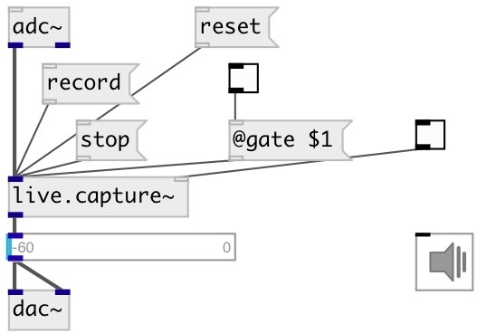

[index](index.html) :: [live](category_live.html)
---

# live.capture~

###### record up to 32s of sound and playback the recorded sound in loop

*доступно с версии:* 0.1

---

## методы:

* **record**
start record 

* **stop**
stop record 

* **reset**
reset recorded data 

## свойства:

* **@gate** 
Получить/установить start/stop recording 
_тип:_ int 
_варианты:_ 0, 1 
_по умолчанию:_ 0 

* **@active** 
Получить/установить on/off dsp processing 
_тип:_ int 
_варианты:_ 0, 1 
_по умолчанию:_ 1 

## входы:

* source signal 
_тип:_ audio
* 1/0 toggle signal 
_тип:_ control

## выходы:

* recorded signal 
_тип:_ audio

## ключевые слова:

[live](keywords/live.html)
[record](keywords/record.html)

**Авторы:** Serge Poltavsky

**Лицензия:** GPL3 or later

