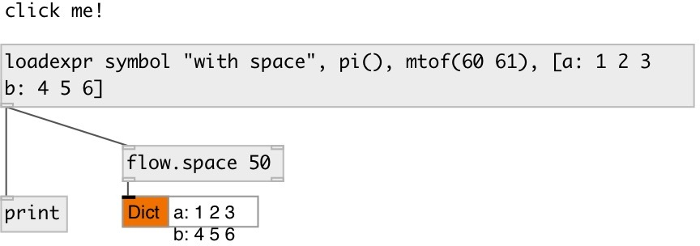

[index](index.html) :: [msg](category_msg.html)
---

# loadexpr

###### send message when patch loads

*доступно с версии:* 0.9.2

---

## информация
like [loadmsg], but support expression calls and datatype Click on object sends message again

## аргументы:

* **ARGS**
message. Comma separated messages are supported 
_тип:_ list 

## выходы:

* message output 
_тип:_ control

## ключевые слова:

[message](keywords/message.html)
[loadbang](keywords/loadbang.html)
[onload](keywords/onload.html)

**Смотрите также:**
[\[loadmsg\]](loadmsg.html)

**Авторы:** Serge Poltavsky

**Лицензия:** GPL3 or later

