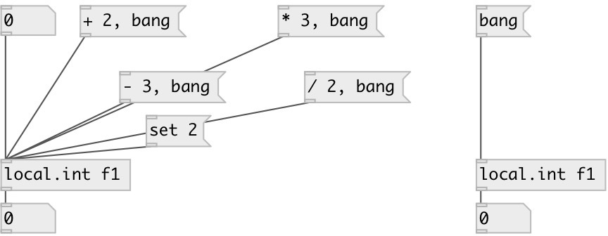

[index](index.html) :: [local](category_local.html)
---

# local.int

###### canvas-scoped named integer variable

*доступно с версии:* 0.1

---

## информация
Defines named local integer variable, accessed by name and available only within its patch (canvas). Note: it is not accessible even from subpatch.

## аргументы:

* **ID**
object ID 
_тип:_ symbol 

## методы:

* **set**
sets new value without output 

* **+**
add to int, no output 

* **-**
substruct from int, no output 

* *****
multiply to, no output 

* **/**
divide by, no output 

## свойства:

* **@value** (readonly)
Получить current value 
_тип:_ int 
_по умолчанию:_ 0 

## входы:

* output value 
_тип:_ control

## выходы:

* integer output 
_тип:_ control

## ключевые слова:

[int](keywords/int.html)
[local](keywords/local.html)

**Смотрите также:**
[\[local.float\]](local.float.html)
[\[local.list\]](local.list.html)
[\[global.int\]](global.int.html)

**Авторы:** Serge Poltavsky

**Лицензия:** GPL3 or later

