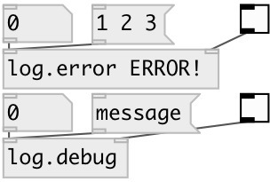

[index](index.html) :: [base](category_base.html)
---

# logger

###### продвинутый логгер для окна Pd

*доступно с версии:* 0.9.1

---

## аргументы:

* **PREFIX**
log message prefix 
_тип:_ list 

## свойства:

* **@active** 
Запросить/установить enabled/disabled logging state 
_тип:_ bool 
_по умолчанию:_ 1 

* **@prefix** 
Запросить/установить log message prefix 
_тип:_ list 

## входы:

* log input 
_тип:_ control
* 1: enable logging, 0: disable logging 
_тип:_ control

## ключевые слова:

[log](keywords/log.html)

**Авторы:** Serge Poltavsky

**Лицензия:** GPL3 or later

