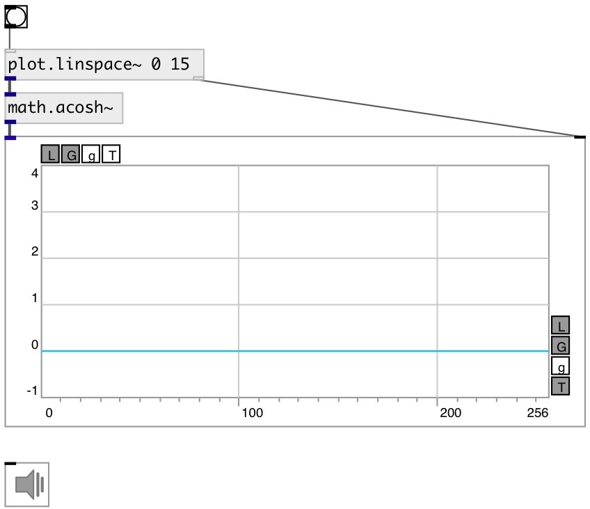

[index](index.html) :: [math](category_math.html)
---

# math.acosh~

###### hyperbolic arc cosine for signals

*доступно с версии:* 0.9

---

## информация
Outputs the principle value of the hyperbolic arc cosine of input signal. Input signal expected to be &gt;= 1, otherwise output will be NAN

## входы:

* input signal 
_тип:_ audio

## выходы:

* result signal 
_тип:_ audio

## ключевые слова:

[math](keywords/math.html)
[hyperbolic](keywords/hyperbolic.html)
[arc](keywords/arc.html)
[cosine](keywords/cosine.html)

**Смотрите также:**
[\[math.cosh~\]](math.cosh~.html)
[\[math.acosh\]](math.acosh.html)

**Авторы:** Serge Poltavsky

**Лицензия:** GPL3 or later

