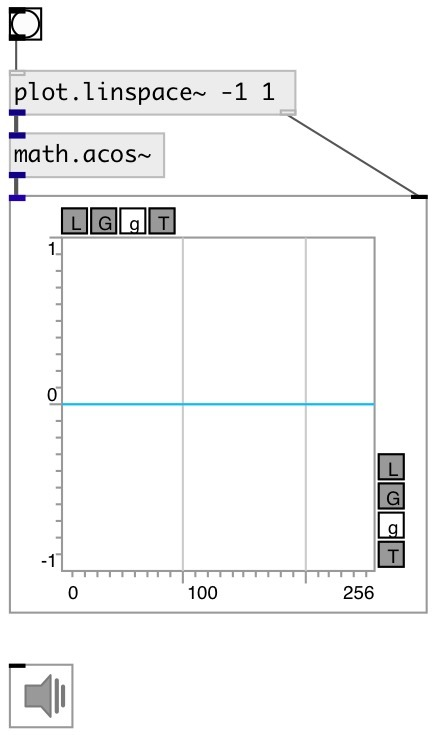

[index](index.html) :: [math](category_math.html)
---

# math.acos~

###### arc cosine function for signals

*доступно с версии:* 0.9

---

## информация
Outputs the principle value of the arc cosine of input signal. The result is in the range [0, pi]

## входы:

* input signal 
_тип:_ audio

## выходы:

* result signal 
_тип:_ audio

## ключевые слова:

[math](keywords/math.html)
[acos](keywords/acos.html)

**Смотрите также:**
[\[math.acos\]](math.acos.html)

**Авторы:** Serge Poltavsky

**Лицензия:** GPL3 or later

