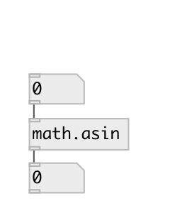

[index](index.html) :: [math](category_math.html)
---

# math.asin

###### arc sine function

*доступно с версии:* 0.1

---

## информация
The asin() function computes the principal value of the arc sine of input value. The result is in the range [-pi/2, +pi/2]. Special values: asin(+-0) returns +-0. asin(x) returns a NAN and raises the &#34;invalid&#34; floating-point exception for |x| &gt; 1.

## входы:

* input value 
_тип:_ control

## выходы:

* result value 
_тип:_ control

## ключевые слова:

[math](keywords/math.html)
[asin](keywords/asin.html)

**Смотрите также:**
[\[math.acos\]](math.acos.html)
[\[math.atan\]](math.atan.html)
[\[math.cos\]](math.cos.html)

**Авторы:** Serge Poltavsky

**Лицензия:** GPL3 or later

