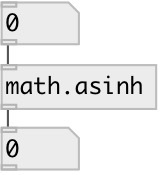

[index](index.html) :: [math](category_math.html)
---

# math.asinh

###### inverse hyperbolic sine function

*доступно с версии:* 0.1

---

## информация
The asinh() function computes the inverse hyperbolic sine of the real argument Special values: asinh(+-0) returns +-0. asinh(+-infinity) returns +-infinity.

## входы:

* input value 
_тип:_ control

## выходы:

* result value 
_тип:_ control

## ключевые слова:

[math](keywords/math.html)
[asinh](keywords/asinh.html)

**Смотрите также:**
[\[math.acosh\]](math.acosh.html)
[\[math.atanh\]](math.atanh.html)
[\[math.exp\]](math.exp.html)

**Авторы:** Serge Poltavsky

**Лицензия:** GPL3 or later

