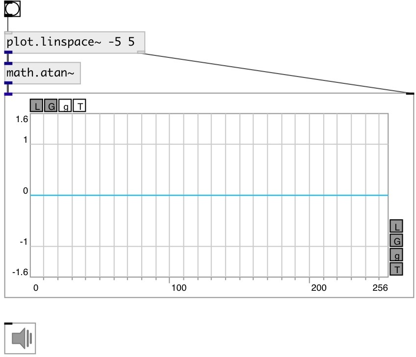

[index](index.html) :: [math](category_math.html)
---

# math.atan~

###### arc tangent for signals

*доступно с версии:* 0.9

---

## информация
Outputs arc tangent of input signal. The result is in the range [-π/2, +π/2]

## входы:

* input signal 
_тип:_ audio

## выходы:

* result signal 
_тип:_ audio

## ключевые слова:

[math](keywords/math.html)
[asin](keywords/asin.html)

**Смотрите также:**
[\[math.atan\]](math.atan.html)
[\[math.acos~\]](math.acos~.html)

**Авторы:** Serge Poltavsky

**Лицензия:** GPL3 or later

