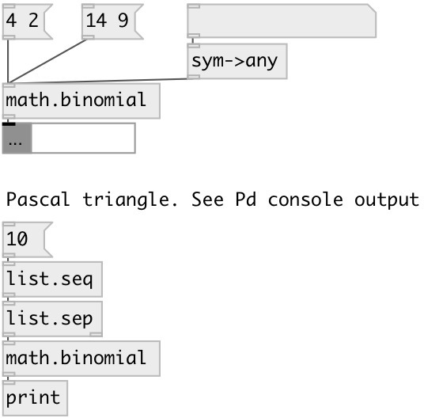

[index](index.html) :: [math](category_math.html)
---

# math.binomial

###### binomial coefficient calculator

*доступно с версии:* 0.9.4

---

## входы:

* calc all coefficients for given order and output them as list 
_тип:_ control

## выходы:

* result value 
_тип:_ control

## ключевые слова:

[math](keywords/math.html)
[binomial](keywords/binomial.html)

**Авторы:** Serge Poltavsky

**Лицензия:** GPL3 or later

