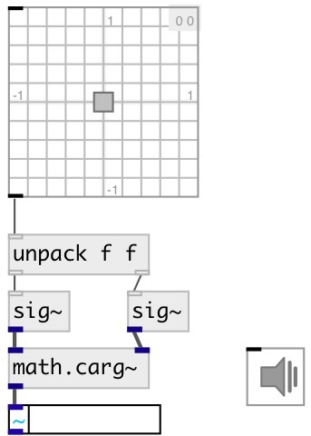

[index](index.html) :: [math](category_math.html)
---

# math.carg~

###### phase angle of a complex signals

*доступно с версии:* 0.9

---

## информация
outputs the phase angle in the interval [−π π]

## входы:

* real part of input signal 
_тип:_ audio
* imag part of input signal 
_тип:_ audio

## выходы:

* signal phase angle in radians 
_тип:_ audio

## ключевые слова:

[math](keywords/math.html)
[complex](keywords/complex.html)
[phase](keywords/phase.html)
[angle](keywords/angle.html)

**Смотрите также:**
[\[math.cabs~\]](math.cabs~.html)

**Авторы:** Serge Poltavsky

**Лицензия:** GPL3 or later

