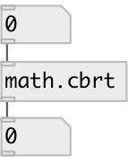

[index](index.html) :: [math](category_math.html)
---

# math.cbrt

###### cube root function

*доступно с версии:* 0.1

---

## информация
The cbrt() function computes the cube root of input value. Special values: cbrt(+-0) returns +-0. cbrt(+-infinity) returns +-infinity.

## входы:

* input value 
_тип:_ control

## выходы:

* result value 
_тип:_ control

## ключевые слова:

[math](keywords/math.html)
[cbrt](keywords/cbrt.html)

**Смотрите также:**
[\[math.sqrt\]](math.sqrt.html)

**Авторы:** Serge Poltavsky

**Лицензия:** GPL3 or later

