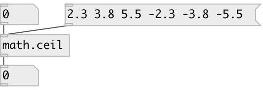

[index](index.html) :: [math](category_math.html)
---

# math.ceil

###### round to smallest integral value not less than input value

*доступно с версии:* 0.1

---

## информация
The ceil() function return the smallest integral value greater than or equal to input value. Special values: ceil(+-0) returns +-0. ceil(+-infinity) returns +-infinity.

## входы:

* input value 
_тип:_ control

## выходы:

* result value 
_тип:_ control

## ключевые слова:

[math](keywords/math.html)
[ceil](keywords/ceil.html)

**Смотрите также:**
[\[math.floor\]](math.floor.html)
[\[math.round\]](math.round.html)
[\[math.trunc\]](math.trunc.html)

**Авторы:** Serge Poltavsky

**Лицензия:** GPL3 or later

