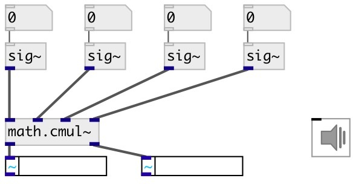

[index](index.html) :: [math](category_math.html)
---

# math.cmul~

###### multiplication of complex signals

*доступно с версии:* 0.7

---

## информация
Calculates for signals (a + bi) * (c + di) = (ac - bd) + (ad + bc)i

## входы:

* real part of input signal1 
_тип:_ audio
* imag part of input signal1 
_тип:_ audio
* real part of input signal2 
_тип:_ audio
* imag part of input signal2 
_тип:_ audio

## выходы:

* real part of result 
_тип:_ audio
* imag part of result 
_тип:_ audio

## ключевые слова:

[math](keywords/math.html)
[complex](keywords/complex.html)
[multiplication](keywords/multiplication.html)

**Смотрите также:**
[\[math.cdiv~\]](math.cdiv~.html)

**Авторы:** Serge Poltavsky

**Лицензия:** GPL3 or later

