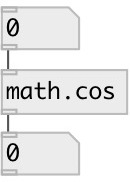

[index](index.html) :: [math](category_math.html)
---

# math.cos

###### cosine function

*доступно с версии:* 0.1

---

## информация
The cos() function computes the cosine of input value (measured in radians). Special values: cos(+-0) returns 1. cos(+-infinity) returns a NaN and raises the &#34;invalid&#34; floating-point exception.

## входы:

* input value 
_тип:_ control

## выходы:

* result value 
_тип:_ control

## ключевые слова:

[math](keywords/math.html)
[cos](keywords/cos.html)

**Смотрите также:**
[\[math.sin\]](math.sin.html)
[\[math.tan\]](math.tan.html)
[\[math.asin\]](math.asin.html)
[\[math.acos\]](math.acos.html)

**Авторы:** Serge Poltavsky

**Лицензия:** GPL3 or later

