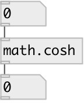

[index](index.html) :: [math](category_math.html)
---

# math.cosh

###### hyperbolic cosine function

*доступно с версии:* 0.1

---

## информация
The coshf() function computes the hyperbolic cosine of input value. Special values: cosh(+-0) returns 1. cosh(+-infinity) returns +infinity.

## входы:

* input value 
_тип:_ control

## выходы:

* result value 
_тип:_ control

## ключевые слова:

[math](keywords/math.html)
[cosh](keywords/cosh.html)

**Смотрите также:**
[\[math.acos\]](math.acos.html)
[\[math.asin\]](math.asin.html)
[\[math.atan\]](math.atan.html)

**Авторы:** Serge Poltavsky

**Лицензия:** GPL3 or later

