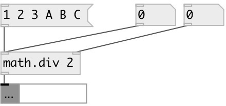

[index](index.html) :: [math](category_math.html)
---

# math.div

###### division (on lists too)

*доступно с версии:* 0.6

---

## аргументы:

* **DIV**
divisor 
_тип:_ float 

## свойства:

* **@div** 
Получить/установить divisor 
_тип:_ float 
_по умолчанию:_ 1 

## входы:

* divident 
_тип:_ control
* change divisor 
_тип:_ control

## выходы:

* float or list 
_тип:_ control

## ключевые слова:

[math](keywords/math.html)
[divide](keywords/divide.html)

**Авторы:** Serge Poltavsky

**Лицензия:** GPL3 or later

