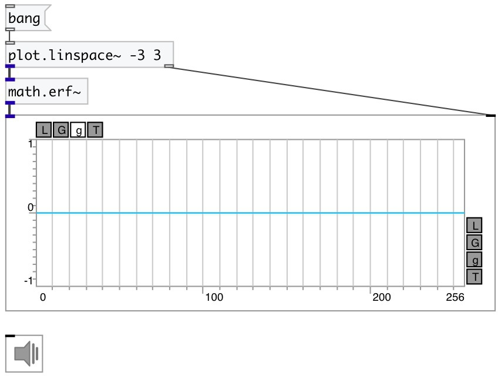

[index](index.html) :: [math](category_math.html)
---

# math.erf~

###### error function for signals

*доступно с версии:* 0.9

---

## информация
In statistics, for non-negative values of x, the error function has the following interpretation: for a random variable Y that is normally distributed with mean 0 and variance 1/2, erf x is the probability that Y falls in the range [−x, x]

## входы:

* input signal 
_тип:_ audio

## выходы:

* output signal 
_тип:_ audio

## ключевые слова:

[math](keywords/math.html)
[error](keywords/error.html)
[gauss](keywords/gauss.html)

**Смотрите также:**
[\[math.erf\]](math.erf.html)

**Авторы:** Serge Poltavsky

**Лицензия:** GPL3 or later

