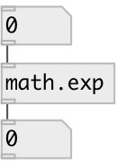

[index](index.html) :: [math](category_math.html)
---

# math.exp

###### exponential functions

*доступно с версии:* 0.1

---

## информация
The exp() function computes e**x, the base-e exponential of x. If x is nearly zero, then the common expression exp(x) - 1.0 will suffer from catastrophic cancellation and the result will have little or no precision. Special values: exp(+-0) return 1. exp(-infinity) return +0. exp(+infinity) return +infinity. For all these functions, a range error occurs if the magnitude of x is too large.

## входы:

* input value 
_тип:_ control

## выходы:

* result value 
_тип:_ control

## ключевые слова:

[math](keywords/math.html)
[exp](keywords/exp.html)

**Смотрите также:**
[\[math.log\]](math.log.html)
[\[math.exp2\]](math.exp2.html)

**Авторы:** Serge Poltavsky

**Лицензия:** GPL3 or later

