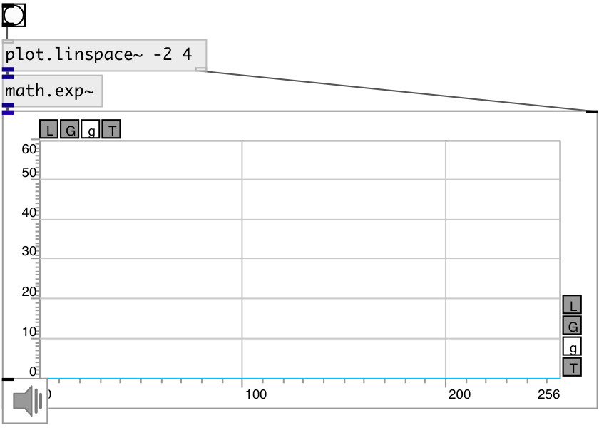

[index](index.html) :: [math](category_math.html)
---

# math.exp~

###### base-e exponential for signal

*доступно с версии:* 0.9

---

## входы:

* input signal 
_тип:_ audio

## выходы:

* output signal 
_тип:_ audio

## ключевые слова:

[math](keywords/math.html)
[exp2](keywords/exp2.html)

**Смотрите также:**
[\[math.log~\]](math.log~.html)
[\[math.exp2~\]](math.exp2~.html)

**Авторы:** Serge Poltavsky

**Лицензия:** GPL3 or later

