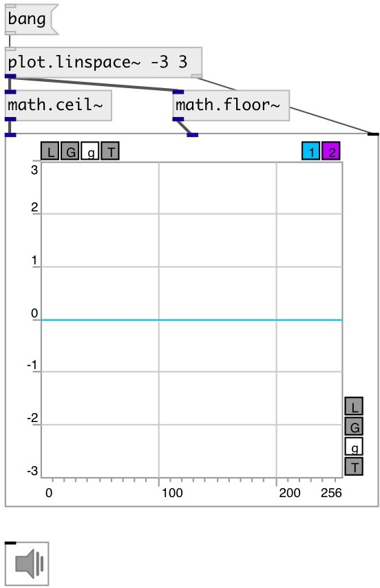

[index](index.html) :: [math](category_math.html)
---

# math.floor~

###### round to largest integral value not greater than x

*доступно с версии:* 0.9

---

## входы:

* input signal 
_тип:_ audio

## выходы:

* result signal 
_тип:_ audio

## ключевые слова:

[math](keywords/math.html)
[floor](keywords/floor.html)

**Смотрите также:**
[\[math.floor\]](math.floor.html)
[\[math.ceil~\]](math.ceil~.html)
[\[math.round~\]](math.round~.html)
[\[math.trunc~\]](math.trunc~.html)

**Авторы:** Serge Poltavsky

**Лицензия:** GPL3 or later

