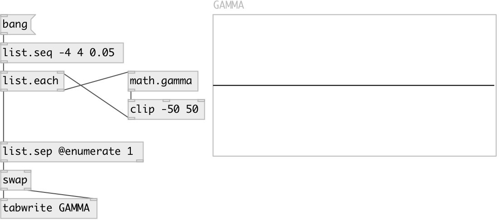

[index](index.html) :: [math](category_math.html)
---

# math.gamma

###### gamma function

*доступно с версии:* 0.9

---

## информация
Extension of factorial function to real numbers For any positive integer n, Γ(n) = (n−1)!

## входы:

* input value 
_тип:_ control

## выходы:

* result value or list 
_тип:_ control

## ключевые слова:

[math](keywords/math.html)
[gamma](keywords/gamma.html)
[factorial](keywords/factorial.html)

**Смотрите также:**
[\[math.gamma\]](math.gamma.html)
[\[math.lgamma~\]](math.lgamma~.html)

**Авторы:** Serge Poltavsky

**Лицензия:** GPL3 or later

