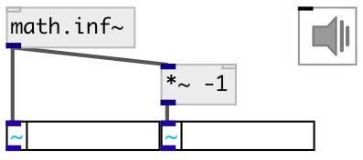

[index](index.html) :: [math](category_math.html)
---

# math.inf~

###### inifinity signal generator

*доступно с версии:* 0.9.1

---

## информация
IEEE 754 floating point numbers can represent positive or negative infinity, and NaN (not a number). These three values arise from calculations whose result is undefined or cannot be represented accurately.

## входы:

* control input 
_тип:_ control

## выходы:

* output value 
_тип:_ audio

## ключевые слова:

[math](keywords/math.html)
[inf](keywords/inf.html)

**Смотрите также:**
[\[math.inf\]](math.inf.html)
[\[math.nan~\]](math.nan~.html)

**Авторы:** Serge Poltavsky

**Лицензия:** GPL3 or later

