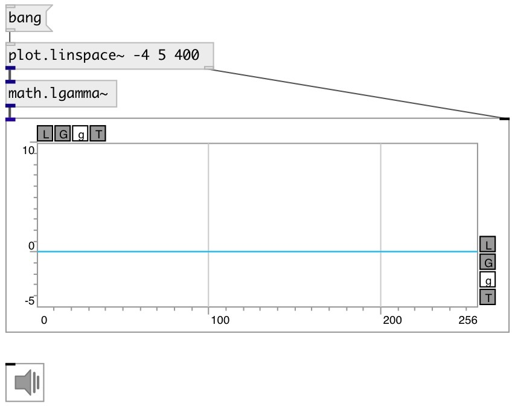

[index](index.html) :: [math](category_math.html)
---

# math.lgamma~

###### natural logarithm of the absolute value of the gamma function for signals

*доступно с версии:* 0.9

---

## входы:

* input signal 
_тип:_ audio

## выходы:

* output signal 
_тип:_ audio

## ключевые слова:

[math](keywords/math.html)
[log](keywords/log.html)
[gamma](keywords/gamma.html)
[factorial](keywords/factorial.html)

**Смотрите также:**
[\[math.lgamma\]](math.lgamma.html)
[\[math.gamma~\]](math.gamma~.html)

**Авторы:** Serge Poltavsky

**Лицензия:** GPL3 or later

