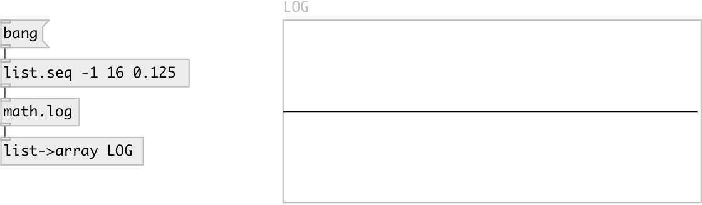

[index](index.html) :: [math](category_math.html)
---

# math.log

###### natural logarithm

*доступно с версии:* 0.1

---

## информация
Computes the value of the natural logarithm of argument x. Special values: log(+-0) return -infinity log(1) return +0. log(x) return a NaN log(+infinity) return +infinity.

## входы:

* input value 
_тип:_ control

## выходы:

* result value 
_тип:_ control

## ключевые слова:

[math](keywords/math.html)
[log](keywords/log.html)

**Смотрите также:**
[\[math.exp\]](math.exp.html)

**Авторы:** Serge Poltavsky

**Лицензия:** GPL3 or later

