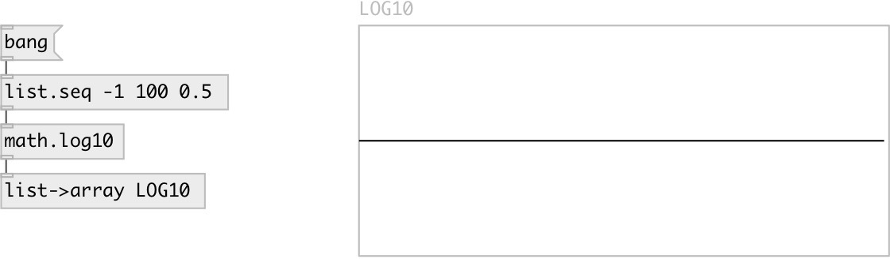

[index](index.html) :: [math](category_math.html)
---

# math.log10

###### logarithm functions

*доступно с версии:* 0.1

---

## информация
The log10() function computes the value of the logarithm of argument x to base 10. Special values: log10(+-0) return -infinity log10(1) return +0. log10(x) return a NaN log10(+infinity) return +infinity.

## входы:

* input value 
_тип:_ control

## выходы:

* result value 
_тип:_ control

## ключевые слова:

[math](keywords/math.html)
[log10](keywords/log10.html)

**Смотрите также:**
[\[math.exp\]](math.exp.html)

**Авторы:** Serge Poltavsky

**Лицензия:** GPL3 or later

