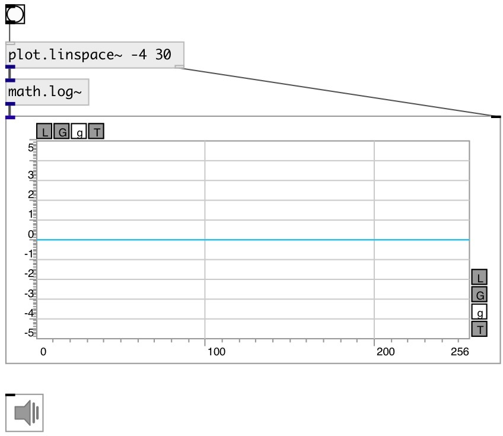

[index](index.html) :: [math](category_math.html)
---

# math.log~

###### natural logarithm

*доступно с версии:* 0.9

---

## информация
Outputs the value of the natural logarithm Special values: log(1) return +0. log(+infinity) return +infinity.

## входы:

* input signal 
_тип:_ audio

## выходы:

* result signal 
_тип:_ audio

## ключевые слова:

[math](keywords/math.html)
[log](keywords/log.html)

**Смотрите также:**
[\[math.exp~\]](math.exp~.html)
[\[math.log2\]](math.log2.html)

**Авторы:** Serge Poltavsky

**Лицензия:** GPL3 or later

