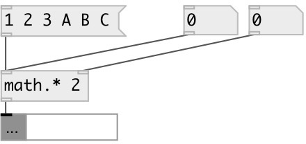

[index](index.html) :: [math](category_math.html)
---

# math.mul

###### multiplication (on lists too)

*доступно с версии:* 0.6

---

## аргументы:

* **MUL**
multiplicand 
_тип:_ float 

## свойства:

* **@mul** 
Получить/установить multiplicand 
_тип:_ float 
_по умолчанию:_ 1 

## входы:

* multiplier 
_тип:_ control
* change multiplicand 
_тип:_ control

## выходы:

* float or list 
_тип:_ control

## ключевые слова:

[math](keywords/math.html)
[mul](keywords/mul.html)

**Авторы:** Serge Poltavsky

**Лицензия:** GPL3 or later

