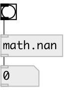

[index](index.html) :: [math](category_math.html)
---

# math.nan

###### Not a Number, unrepresentable value

*доступно с версии:* 0.1

---

## информация
In computing, NaN, standing for not a number, is a numeric data type value representing an undefined or unrepresentable value, especially in floating-point calculations. Systematic use of NaNs was introduced by the IEEE 754 floating-point standard in 1985, along with the representation of other non-finite quantities like infinities. When an operation results in a quiet NaN, there is no indication that anything is unusual until the program checks the result and sees a NaN. That is, computation continues without any signal from the floating point unit (FPU) or library if floating-point is implemented in software. A signalling NaN will produce a signal, usually in the form of exception from the FPU. Whether the exception is thrown depends on the state of the FPU. Note: in Pd float point exceptions are disabled.

## свойства:

* **@type** 
Получить/установить type of outputed NaN: quiet or signal 
_тип:_ symbol 
_варианты:_ quiet, signal 
_по умолчанию:_ quiet 

* **@quiet** 
Получить/установить alias to @type quiet 
_тип:_ alias 

* **@signal** 
Получить/установить alias to @type signal 
_тип:_ alias 

## входы:

* outputs value 
_тип:_ control

## выходы:

* output value 
_тип:_ control

## ключевые слова:

[math](keywords/math.html)
[nan](keywords/nan.html)

**Смотрите также:**
[\[math.nan~\]](math.nan~.html)
[\[math.inf\]](math.inf.html)

**Авторы:** Serge Poltavsky

**Лицензия:** GPL3 or later

