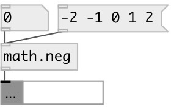

[index](index.html) :: [math](category_math.html)
---

# math.neg

###### negate function

*доступно с версии:* 0.1

---

## информация
Returns value with opposite sign

## входы:

* input value 
_тип:_ control

## выходы:

* result 
_тип:_ control

## ключевые слова:

[math](keywords/math.html)
[negate](keywords/negate.html)

**Авторы:** Serge Poltavsky

**Лицензия:** GPL3 or later

