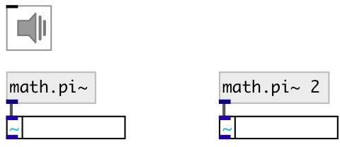

[index](index.html) :: [math](category_math.html)
---

# math.pi~

###### mathematical constant

*доступно с версии:* 0.9

---

## информация
The number PI is a mathematical constant, the ratio of a circle&#39;s circumference to its diameter, commonly approximated as 3.14159.

## аргументы:

* **K**
multiplier. default is 1 
_тип:_ float 

## свойства:

* **@k** (initonly)
Запросить/установить multiplier 
_тип:_ float 
_по умолчанию:_ 1 

## выходы:

* output value 
_тип:_ audio

## ключевые слова:

[math](keywords/math.html)
[pi](keywords/pi.html)

**Смотрите также:**
[\[math.pi\]](math.pi.html)

**Авторы:** Serge Poltavsky

**Лицензия:** GPL3 or later

