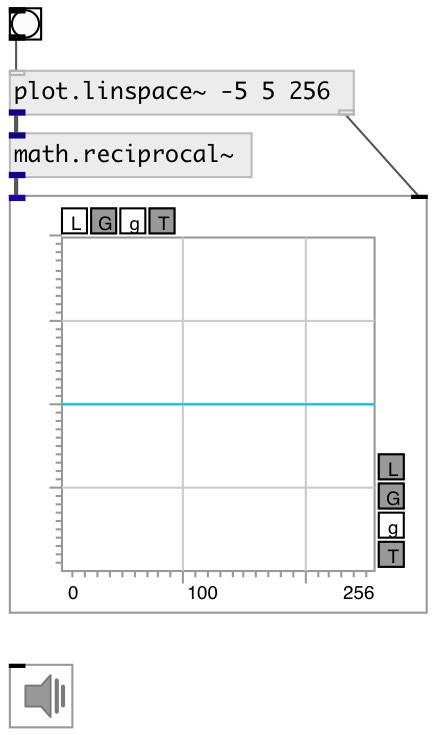

[index](index.html) :: [math](category_math.html)
---

# math.reciprocal~

###### calculate reciprocal number for signals

*доступно с версии:* 0.9

---

## входы:

* input signal 
_тип:_ audio

## выходы:

* output signal 
_тип:_ audio

## ключевые слова:

[math](keywords/math.html)
[reciprocal](keywords/reciprocal.html)

**Авторы:** Serge Poltavsky

**Лицензия:** GPL3 or later

