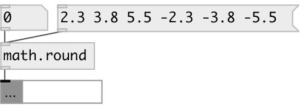

[index](index.html) :: [math](category_math.html)
---

# math.round

###### round to integral value, regardless of rounding direction

*доступно с версии:* 0.1

---

## информация
The round() functions return the integral value nearest to x rounding half-way cases away from zero, regardless of the current rounding direction. Special values: round(+-0) returns +-0. round(+-infinity) returns +-infinity.

## входы:

* input value 
_тип:_ control

## выходы:

* result value 
_тип:_ control

## ключевые слова:

[math](keywords/math.html)
[round](keywords/round.html)

**Смотрите также:**
[\[math.ceil\]](math.ceil.html)
[\[math.floor\]](math.floor.html)
[\[math.trunc\]](math.trunc.html)

**Авторы:** Serge Poltavsky

**Лицензия:** GPL3 or later

