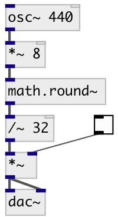

[index](index.html) :: [math](category_math.html)
---

# math.round~

###### signal round

*доступно с версии:* 0.4

---

## входы:

* input signal 
_тип:_ control

## выходы:

* output rounded signal 
_тип:_ control

## ключевые слова:

[math](keywords/math.html)
[round~](keywords/round~.html)

**Смотрите также:**
[\[math.round\]](math.round.html)

**Авторы:** Serge Poltavsky

**Лицензия:** GPL3 or later

