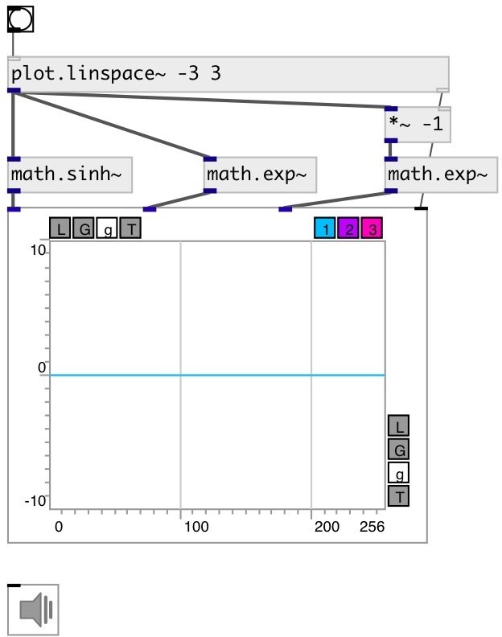

[index](index.html) :: [math](category_math.html)
---

# math.sinh~

###### hyperbolic sine for signals

*доступно с версии:* 0.9

---

## информация
Outputs hyperbolic sine of input signal sinh x = (ℯˣ - ℯ⁻ˣ)/2

## входы:

* input signal 
_тип:_ audio

## выходы:

* result signal 
_тип:_ audio

## ключевые слова:

[math](keywords/math.html)
[hyperbolic](keywords/hyperbolic.html)
[arc](keywords/arc.html)
[sine](keywords/sine.html)

**Смотрите также:**
[\[math.asinh~\]](math.asinh~.html)
[\[math.sinh\]](math.sinh.html)

**Авторы:** Serge Poltavsky

**Лицензия:** GPL3 or later

