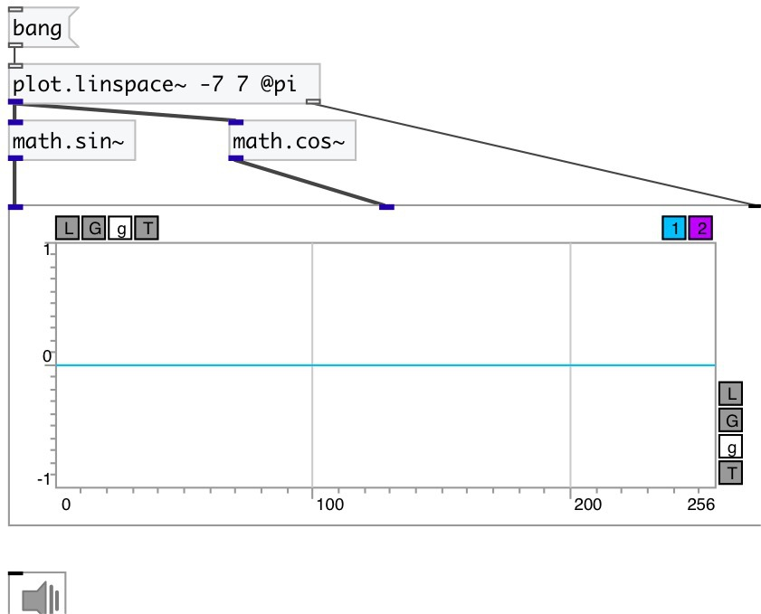

[index](index.html) :: [math](category_math.html)
---

# math.sin~

###### sine function

*доступно с версии:* 0.9

---

## информация
Computes the sine of input signal (in radians)

## входы:

* input signal 
_тип:_ audio

## выходы:

* result signal 
_тип:_ audio

## ключевые слова:

[math](keywords/math.html)
[sin](keywords/sin.html)

**Смотрите также:**
[\[math.sin\]](math.sin.html)
[\[math.cos~\]](math.cos~.html)

**Авторы:** Serge Poltavsky

**Лицензия:** GPL3 or later

